# opal-authentik-connector

## Setup
### Setup the custom connector source code

Clone the custom connector repository

```bash
git clone https://github.com/opalsecurity/opal-authentik-connector.git
```


The following environment variables are required to run the Authentik custom connector. You can see them in `.env.sample`.

```bash
AUTHENTIK_TOKEN=<populate-in-next-step>
AUTHENTIK_HOST=<authentik-host>
AUTHENTIK_SCHEME=<http or https>

OPAL_SIGNING_SECRET=<populate-later>
```

You can deploy the Authentik custom connector to your own infrastructure, as long as it is accessible over the internet.
### Setting up a service account in Authentik

Now we need to get an API token from Authentik. Note that we cannot use a user’s API token, we have to create a service account and create an API token for that. 

Open up the admin panel for Authentik

Open Directory → Users

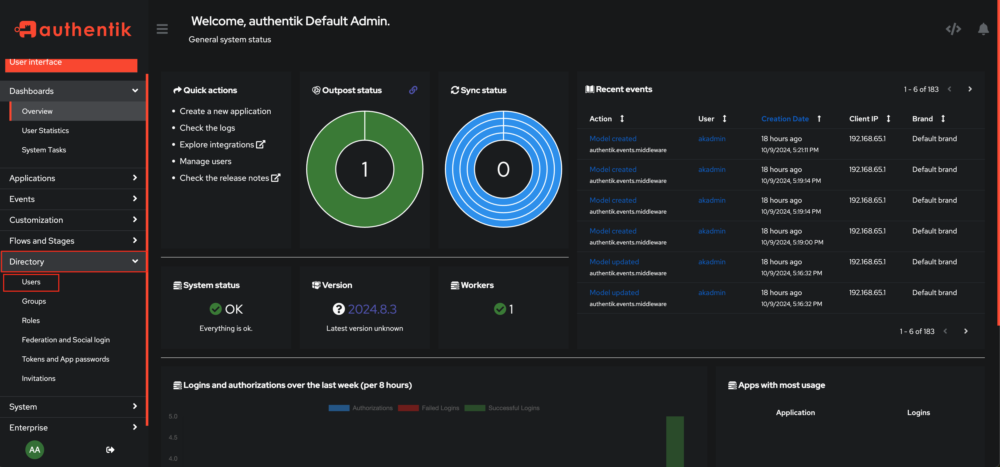

Click “Create Service Account”

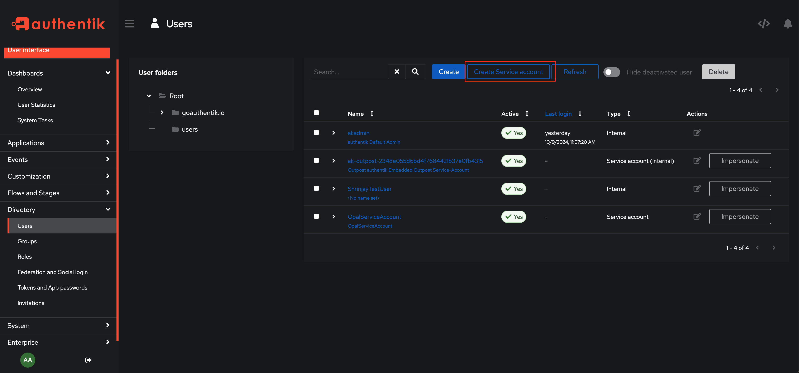

Set whatever username you’d like, disable “Create Group” and “Expiring” as we do not want the service account to expire. Then hit Create

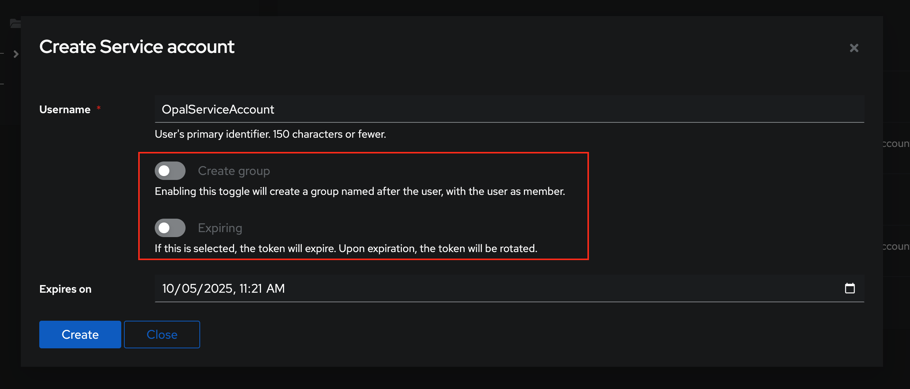

Go to Directory → Users and open the service account

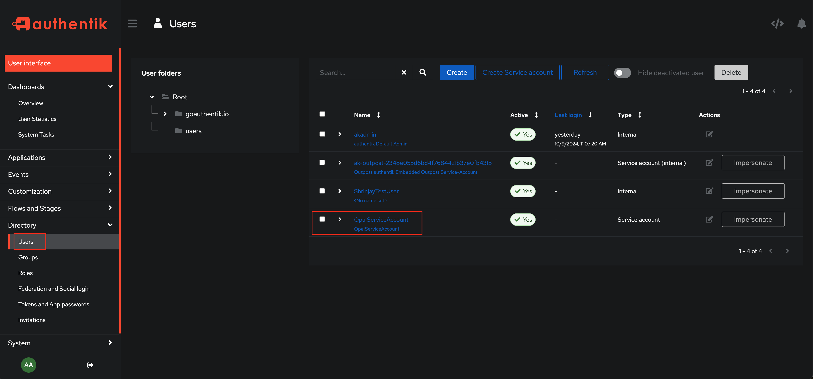

Select “Permissions” and assign the following permissions:

- Add user to group
- Can view Group
- Can view User
- Remove user from group

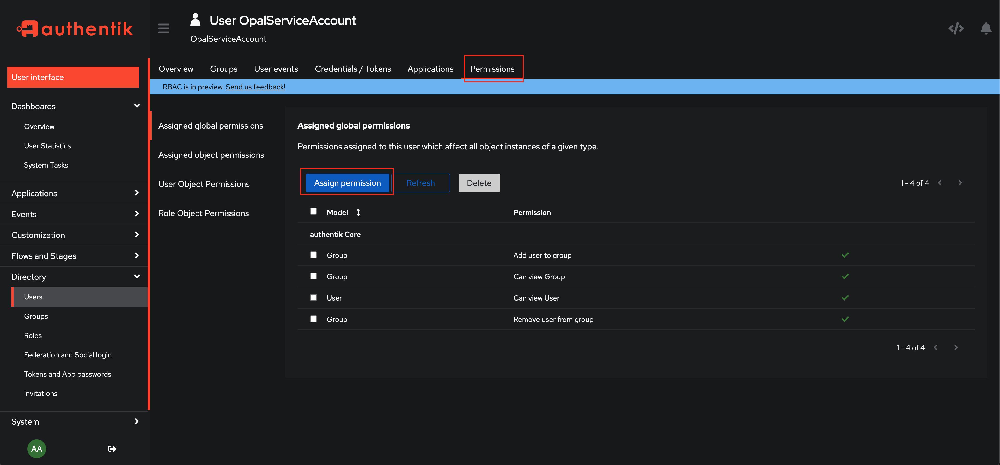

Go to Directory → Tokens and App Passwords

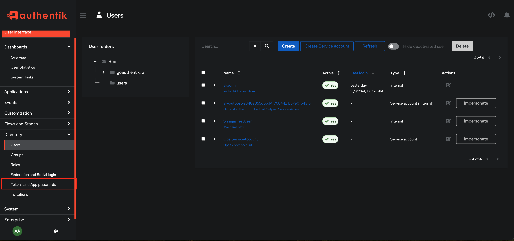

Click “Create”

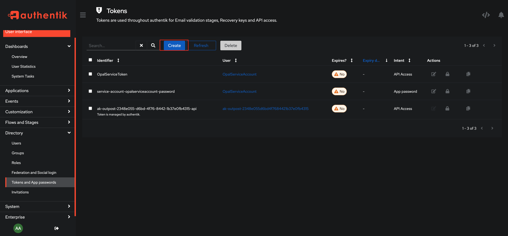

Use any identifier you’d like, make sure “User” is set to the service account created above, “Intent” is “API Token” and “Expiring” is set to off as we have no method to refresh tokens

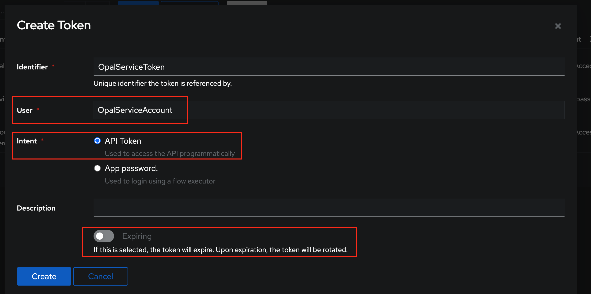

Now click the copy icon to copy your newly created token, and paste it into your `.env` file or other secret store

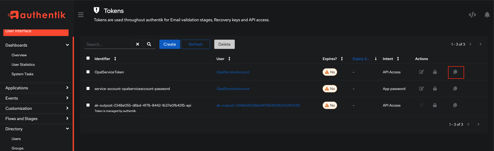

# Setup Custom Connector in Opal

Go to Catalog → Add

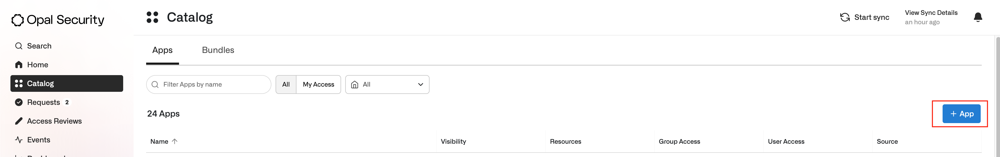

Go to Custom → Custom App

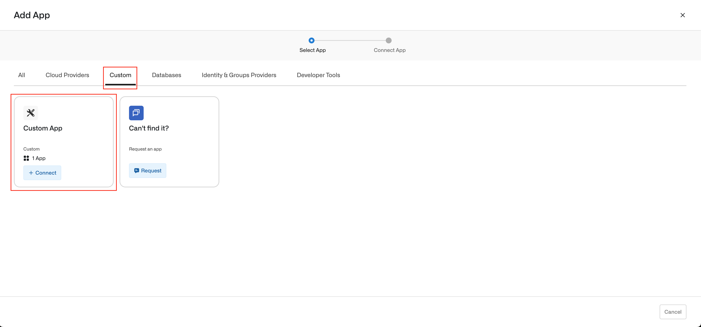

Select “Use custom app connector”, set the identifier to whatever you’d like, and set “Base URL” to the URL where your Authentik Custom Connector is hosted.

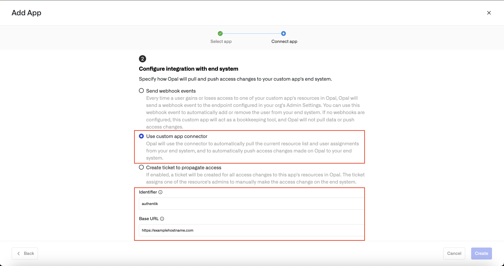

Click Signing Secret → Generate, copy the signing secret and set it as the `OPAL_SIGNING_SECRET` in the environment where your custom connector is hosted. 

Enable “Connector Groups” and make sure “Nested Resources” is disabled

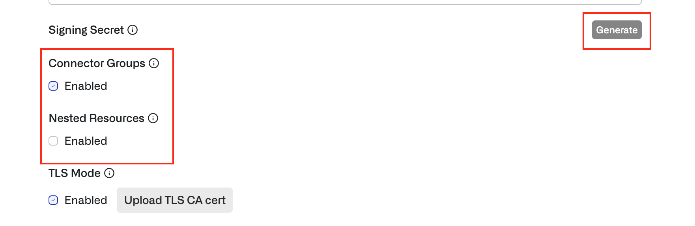

Now click “Create”

Your custom connector should be ready now! Sync the app and your groups should show up.